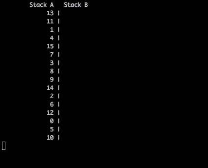
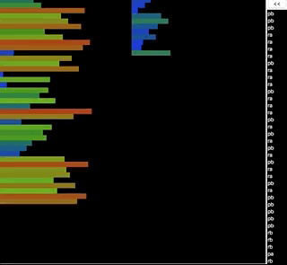

# Push_Swap

#### Final Score 105/100

## Challenge

Sort a random list of integers using the smallest number of moves, 2 stacks
and a limited set of operations. <br />
<br />

You start with two empty stacks: **a** and **b**. You are given a random list of integers via command line arguments.
<br />
<br />

Only these moves are allowed:
- `sa` : swap a - swap the first 2 elements at the top of stack a. Do nothing if there is only one or no elements).
- `sb` : swap b - swap the first 2 elements at the top of stack b. Do nothing if there is only one or no elements).
- `ss` : `sa` and `sb` at the same time.
- `pa` : push a - take the first element at the top of b and put it at the top of a. Do
nothing if b is empty.
- `pb` : push b - take the first element at the top of a and put it at the top of b. Do
nothing if a is empty.
- `ra` : rotate a - shift up all elements of stack a by 1. The first element becomes
the last one.
- `rb` : rotate b - shift up all elements of stack b by 1. The first element becomes the last one.
- `rr` : `ra` and `rb` at the same time.
- `rra` : reverse rotate a - shift down all elements of stack a by 1. The last element becomes the first one.
- `rrb` : reverse rotate b - shift down all elements of stack b by 1. The last element becomes the first one.
- `rrr` : `rra` and `rrb` at the same time.
<br />

At the end, **stack b** must empty empty and all integers must be in **stack a**, sorted in ascending order. <br />
<br />

## The Project
Create two programs: ```checker``` and ```push_swap```. <br />

The ```checker``` program reads a random list of integers from the stdin, stores them, and checks to see
if they are sorted. <br />
<br />
The ```push_swap``` program calculates the moves to sort the integers – *pushing, popping, swapping* and *rotating* 
them between **stack a** and **stack b** – and displays those directions on the stdout. <br />
<br />
You can pipe ```push_swap``` into ```checker```, and ```checker``` will verify that ```push_swap```'s instructions were successful. 
<br />

Both programs must mandatorily parse input for errors, including empty strings, no parameters, 
non-numeric parameters, duplicates, and invalid/non-existent instructions.

**Push_Swap** must conform to the [42 Norm](https://cdn.intra.42.fr/pdf/pdf/960/norme.en.pdf). <br />
Using normal ```libc``` functions is strictly forbidden. Students are however, allowed to use: ```write```, ```read```, ```malloc```, ```free```, ```exit```. 
It must not have any memory leaks. Errors must be handled carefully. <br />
In no way can it quit in an unexpected manner (segmentation fault, bus error, double free, etc).

## Approach

I stored all integers parsed into the stack in a **doubly-circular linked list**. This permitted me to access both the top and bottom of each stack (**a** and **b**) in the fewest number of moves, giving me the most efficient access to sort through all integers.  <br />

```./push_swap``` writes recommended moves to the ```stdout```, which ```./checker``` then reads off the ```stdin``` and parses. I used a **jump table** to parse the moves and launch the corresponding function. This was much more efficient than an ```if tree```, and triggered an error message for invalid input. <br />

To try this out, launch ```./checker```. To push an integer to **stack b**, type ```pb``` and hit ‘enter’. To see if a combination of moves has sorted the stack, type ```control D``` to finish, and the ```./checker``` will display “OK” for sorted or “KO” for unsorted. <br />

The algorithms in ```./push_swap``` to sort the stack are relatively straight-forward. I had 3 different algorithms: one for 5 numbers or less, one for 100 numbers or less, and one for 500 numbers or less. <br />

For 100 <  numbers, I find the median and push everything below the median into **stack b**. Then I identify each the largest and smallest integer in **stack b**, and determine which is most efficient to rotate up/down and push back to **stack a** (along with the specific moves to make that happen). Then I execute those moves. <br />

In this way, integers are pushed back to **stack a** already sorted. I then repeat the process for everything above the median. <br />

For 500 < numbers,  I executed the same process but divided **stack a** by quarters instead of median. <br />

## Usage
Run ```make```.

The **checker** program is used as follows:
```c
  ./checker 5 2 3 1 4
```
```c
  ./checker "-50 -400 -20 -1 -100"
```
```c
  ./checker "-22" "35" "40" "-15" "75"
```

The **push_swap** program is used in the same way
```c
  ./push_swap 5 2 3 1 4
```

You can run the two together using:
```c
  ARG=`ruby -e "puts (0..100).to_a.shuffle.join(' ')"`; ./push_swap $ARG | ./checker -v $ARG
```
Note: the **-v (debug) flag** shows the stack status after each operation. 

<br />

To see push_swap in action, run ```make``` and then the following script:
```
python3 pyviz.py `ruby -e "puts (1..20).to_a.shuffle.join(' ')"`
```

